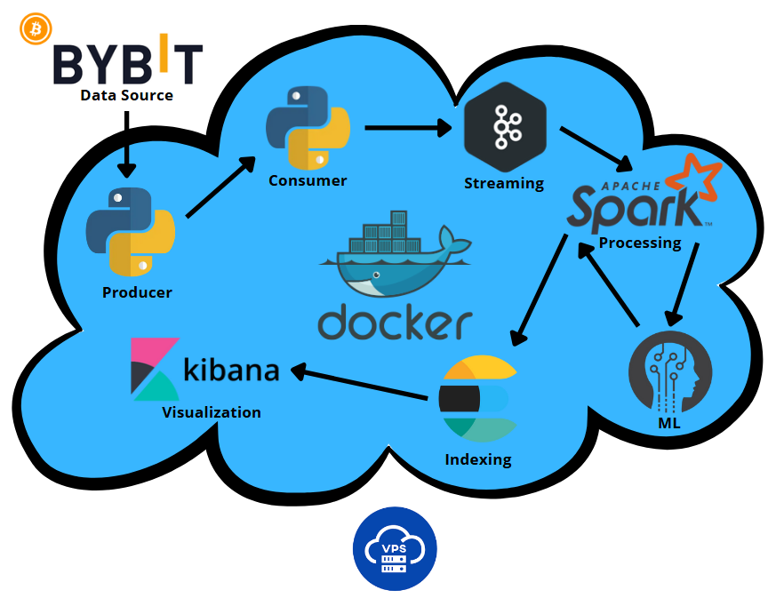
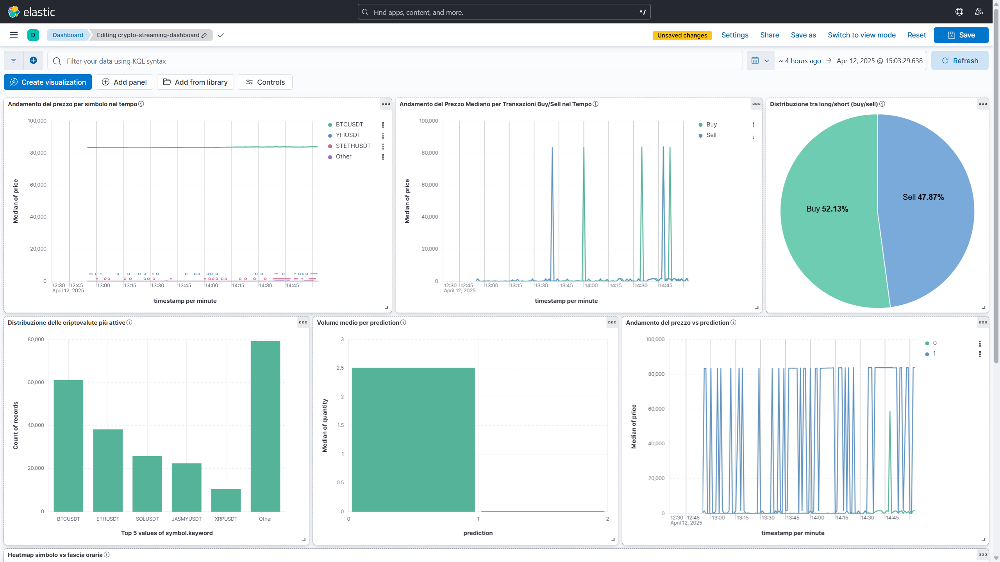

# 🔗 Crypto Real-Time Streaming Dashboard

## 📩 Problematica

Nel mondo delle criptovalute, i dati di mercato sono generati in quantità massicce e in tempo reale. Tuttavia, per analizzarli efficacemente e in modo tempestivo servono strumenti capaci di:

- raccogliere i dati da fonti esterne in streaming,  
- processarli rapidamente,  
- salvarli in un sistema scalabile e interrogabile,  
- visualizzarli in dashboard intuitive.  

Molti strumenti esistenti offrono queste funzioni separatamente, ma pochi offrono una pipeline **completa e personalizzabile** per progetti di analisi in tempo reale.

## 🌟 Obiettivo del progetto

Realizzare una pipeline di **data streaming real-time** che raccolga dati di **trade pubblici** da Bybit (una delle principali piattaforme crypto), li invii a Kafka, li processi con Spark Streaming, li salvi su Elasticsearch e li visualizzi su Kibana. In questo modo:

- puoi analizzare **in tempo reale** il comportamento di mercato,  
- identificare pattern, volumi, anomalie,  
- creare dashboard dinamiche per supportare decisioni data-driven.  

Inoltre, è stata integrata una componente **di machine learning** per **predire la direzione del mercato** in base alle caratteristiche di ogni trade.

## 🧠 Modulo Machine Learning

È stato aggiunto un sistema predittivo per classificare ogni transazione come **probabile aumento (1)** o **diminuzione (0)** del prezzo:

### 📦 Dataset

Durante la fase iniziale, ho valutato l'utilizzo di **dataset esistenti** per addestrare il modello. Tuttavia, essendo il mio stream di dati basato su **transazioni in tempo reale di Bybit**, con struttura e frequenza altamente specifiche, ho deciso di generare un dataset **customizzato** per rispecchiare fedelmente il comportamento del mio sistema.

- I dati storici sono stati **esportati direttamente da Elasticsearch** (dove vengono salvati dallo stream Spark) in formato `.json`
- È stato effettuato un **preprocessing** per creare un file `CSV` compatibile, estrapolando i seguenti campi per ogni trade:
  - `price`
  - `quantity`
  - `is_buy` (booleano 1/0)
  - `target` (etichetta 1 o 0 per classificazione)
 
### 🔢 Come abbiamo generato la colonna target

L’obiettivo era classificare ogni trade in base alla **direzione del prezzo**:

- 1 se il prezzo **aumenta** dopo il trade
- 0 se il prezzo **diminuisce o rimane uguale**

#### 📦 Passaggi:
1. **Ordinamento temporale**: i trade sono stati ordinati usando il timestamp original_time (formato ISO 8601).
2. **Confronto dei prezzi**: per ogni riga, abbiamo confrontato il prezzo con quello della riga successiva.
3. **Assegnazione del target**:
   
```python
   if next_price > current_price:
       target = 1
   else:
       target = 0
```
4. **Pulizia finale**: l’ultima riga, non avendo un valore successivo, è stata eliminata.

In questo modo, è stato creato un dataset customizzato utilizzabile per l’addestramento.

### 🤖 Addestramento

Il modello utilizzato è un 'Random Forest Classifier' implementato con 'scikit-learn'. L’addestramento avviene all’interno di un container Docker isolato, utilizzando il dataset generato tramite preprocessing personalizzato, eseguendo il comando:
```bash
docker compose --profile train run --rm ml-trainer
```
### 🚀 Servizio di inferenza

- È stato sviluppato un **microservizio FastAPI** per esporre un endpoint `/predict`
- Ogni nuova transazione viene inviata a questo endpoint da Spark, che riceve in risposta la **predizione** in tempo reale

### ⚙️ Integrazione con Spark

- Lo script Spark è stato aggiornato per **chiamare il microservizio ML** per ogni batch e **arricchire i dati Elasticsearch** con il campo `"prediction"`

## 🛠️ Tecnologie utilizzate e motivazioni

| Tecnologia                 | Ruolo nel progetto                          | Perché è stata scelta                                              |
|---------------------------|---------------------------------------------|--------------------------------------------------------------------|
| **Bybit WebSocket API**   | Sorgente dei dati (real-time public trades) | Fornisce dati affidabili, aggiornati al secondo, via WebSocket     |
| **Apache Kafka**          | Ingestione e buffer dei dati                | Alta disponibilità, scalabilità e gestione dello stream            |
| **Apache Spark Streaming**| Processamento in tempo reale                | Supporta trasformazioni avanzate e scrittura su Elasticsearch      |
| **Elasticsearch**         | Archiviazione e indicizzazione dei dati     | Ricerca veloce, supporto nativo per time series e analisi testuali |
| **Kibana**                | Visualizzazione dei dati                    | Dashboard potenti e real-time integrate con Elasticsearch          |
| **FastAPI**               | Servizio di inferenza per ML                | Leggero, veloce e perfetto per microservizi REST                   |
| **scikit-learn**          | Addestramento del modello predittivo        | Semplice ed efficace per classificazione supervisionata            |
| **Docker**                | Isolamento e portabilità dei servizi        | Facilita il deploy locale e la gestione dei container              |
| **Python**                | Linguaggio per ingestione e orchestrazione  | Semplice, potente, ampiamente usato nella data engineering         |

## 🔄 Architettura e flusso dati



## 🔎 Esempi di utilizzo e visualizzazioni

- **Andamento del prezzo per simbolo nel tempo**
- **Andamento del Prezzo Mediano per Transazioni Buy/Sell nel Tempo**
- **Distribuzione tra long/short**
- **Distribuzione delle criptovalute più attive**
- **Volume medio per prediction**
- **Andamento del prezzo vs prediction**



## 💡 Conclusione e possibilità di espansione

Il progetto mostra come si può creare una **pipeline di streaming scalabile e flessibile**, utile per:

- il monitoraggio in tempo reale del mercato crypto,  
- l’analisi dei trend e delle fluttuazioni,  
- lo sviluppo di modelli predittivi per supporto decisionale  

🔮 **Possibili estensioni future**:

- Addestramento continuo del modello (online learning)
- Integrazione con Telegram per alert automatici
- Analisi storiche più avanzate (ex: rolling windows)
- Integrazione con ulteriori indicatori tecnici (RSI, MACD, ecc.)

---

### 🧪 Comandi di utilizzo

```bash
docker compose build
docker compose --profile train run --rm ml-trainer  # Allena il modello ML
docker compose up -d                                # Avvia tutti i servizi
```
